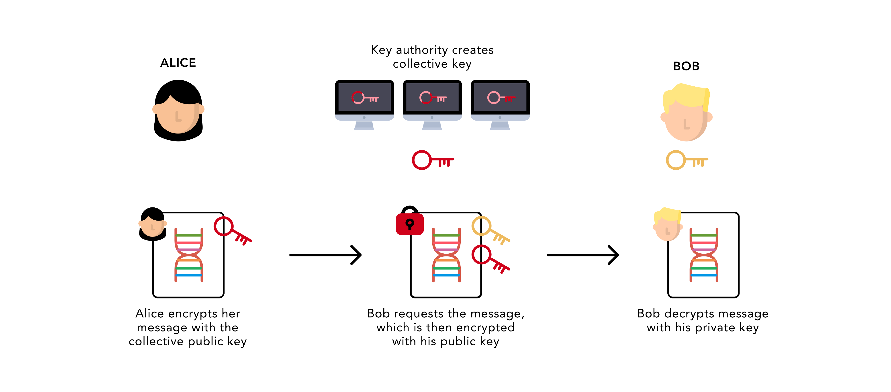

# homomorphic-encryption
Homomorphic encryption is a form of encryption that permits users to perform computations on its encrypted data without first decrypting it. These resulting computations are left in an encrypted form which, when decrypted, result in an identical output to that produced had the operations been performed on the unencrypted data. Homomorphic encryption can be used for privacy-preserving outsourced storage and computation. This allows data to be encrypted and out-sourced to commercial cloud environments for processing, all while encrypted.

For sensitive data, such as health care information, homomorphic encryption can be used to enable new services by removing privacy barriers inhibiting data sharing or increase security to existing services. For example, predictive analytics in health care can be hard to apply via a third party service provider due to medical data privacy concerns, but if the predictive analytics service provider can operate on encrypted data instead, these privacy concerns are diminished. Moreover, even if the service provider's system is compromised, the data would remain secure.

# Types of homomorphic encryption
* Partially homomorphic encryption encompasses schemes that support the evaluation of circuits consisting of only one type of gate, e.g., addition or multiplication.
* Somewhat homomorphic encryption schemes can evaluate two types of gates, but only for a subset of circuits.
* Leveled fully homomorphic encryption supports the evaluation of arbitrary circuits composed of multiple types of gates of bounded (pre-determined) depth.
* Fully homomorphic encryption (FHE) allows the evaluation of arbitrary circuits composed of multiple types of gates of unbounded depth, and is the strongest notion of homomorphic encryption.

# License
The bloomfilter library is licensed under the [Apache License 2.0](https://choosealicense.com/licenses/apache-2.0/), also included in our repository in the `LICENSE` file.
